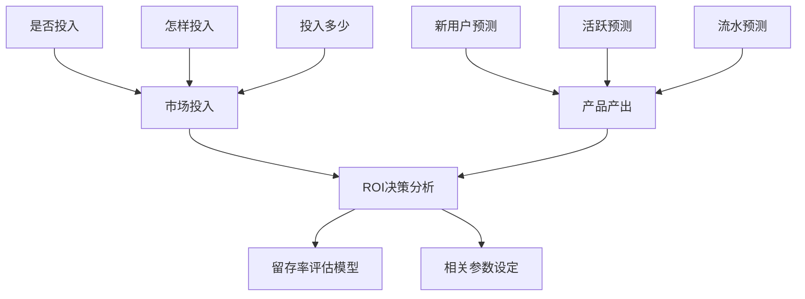

# **第一章**

## 1.1 数羊的故事：数据分析师不应当只会数羊

    不能只是发现那些本就应该发现的“经验和常识”，而应当掌握数据探索方法，发现数据潜在的价值——预见“坏的未来”和“好的未来”

## 1.2 一份好的分析报告应具备的要点

    层次分明、结构清晰
    结论明确，分析结论不宜过多
    要有解决方案和建议方案
    不要害怕或回避“不良结论”

# **第二章：游戏关键数据指标**

## 2.1 转化率

### 2.1.1 激活率

+ 激活是指用户安装好客户端以后联网打开客户端
+ 公式

$$
激活率 = 激活量 / 安装量
$$

$$
（激活码的）激活率 = 激活量 / 激活码的发放量
$$

$$
（激活码的）激活且登录率 =激活码的发放量 / 激活码激活量
$$

+ 激活码的激活且登录率反映实际进入游戏的用户数量，需重点关注

  >90%：优秀
  80%~90%：较好
  60%~80%：一般
  <60%：较差

### 2.1.2 转化率漏斗

+ 运营目标

  拉新：通过渠道合作和广告营销等方式，获得新用户
  促活：让用户愿意更频繁、更开心的游戏
  留存：将获得的用户能够尽量持久地留在产品上
  付费转化：促进用户充值和消费
+ 漏斗

  点击——>下载——>安装——>激活——>注册——>进入游戏——>付费

## 2.2 留存率

+ 新增用户在一段时间内再次登录游戏的比例，反映由初期的不稳定的用户转化为活跃用户、稳定用户、忠诚用户的过程
+ 日留存率

  $$
  次日留存率 = 第1天新增用户在第2天登录过的人数 / 第1天新增用户数$$ 
  $$7日留存率 = 第1天新增用户在第7天登录过的人数 / 第1天新增用户数
  $$

  $$
  日留存率 = 第1天新增用户在第30天登录过的人数 / 第1天新增用户数
  $$
+ 周留存率

  $$
  周留存率 = 第1周新增用户在第2周登录过的人数 / 第1周新增用户数
  $$
+ 月留存率

  $$
  月留存率 = 第1月新增用户在次月登录过的人数 / 第1月新增用户数
  $$
+ 加权留存率

  当人数变化大时，数据会产生偏差，加权之后数据更稳定
  举例
  1号：第1天新用户数100，第2天留存用户数50，次日留存率50%
  2号：第1天新用户数10，第2天留存用户数9，次日留存率90%
  |日期|第1天新用户数|第2天留存用户数|次日留存率|
  |:---:|:---:|:---:|:---:|
  |1号|100|20|50%|
  |2号|10|9|90%|
  留存率均值：(50% + 90%) / 2 = 70%
  加权平均留存率：(50+9) / (100+10) = 53.64%
+ 游戏评级留存率标准

  限量发放激活码封测：封测周期要求7天及以上，新登录人数在5000及以上
  第1天留存率：优秀65%，良好45%，一般30%，较差30%以下
  第3天留存率：优秀55%，良好35%，一般25%，较差25%以下
  第3天留存率：优秀35%，良好20%，一般11%，较差11%以下

  ||优秀|良好|一般|较差|
  |:---:|:---:|:---:|:---:|:---:|
  |第1天留存率|65%|45%|30%|30%以下|
  |第3天留存率|55%|35%|25%|25%以下|
  |第7天留存率|55%|35%|25%|25%以下|

  不限量封测、不发放激活码：用户规模至少1万
  第1天留存率：优秀45%，良好35%，一般20%，较差20%以下
  第3天留存率：优秀30%，良好20%，一般15%，较差15%以下
  第3天留存率：优秀25%，良好15%，一般10%，较差10%以下

  不限量封测的留存率接近于公测后的留存率

## 2.3 用户付费指标

+ 付费率

  $$
  付费率 = 付费人数 / 活跃人数
  $$
+ ARPPU

  $$
  PPU（平均每付费用户收入）= 付费金额 / 付费人数
  $$
+ ARPU

  $$
  PU（每用户平均收入）= 付费金额 / 活跃人数
  $$

  ARPU > 5，较好
  3 <=  ARPU <= 5，一般
  ARPU < 3，较差

  付费率、ARPPU、ARPU理论上越高越好，但三个指标很难兼得
  一般来说，高付费率的游戏，ARPPU比较低；低付费率的游戏，ARPPU比较高；ARPU从某种程度上能衡量游戏的盈利能力

## 2.4 导入用户成本

+ 公式

  $$
  CPC（平均每个点击用户成本）= 广告投入总额 / 所投的广告带来的点击用户数
  $$

  $$
  CPA（平均每个激活用户成本）= 广告投入总额 / 所投的广告带来的激活用户数
  $$

  $$
  CPR（平均每个注册用户成本）= 广告投入总额 / 所投的广告带来的注册用户数
  $$

  $$
  CPL（平均每个登录用户成本）= 广告投入总额 / 所投的广告带来的登录用户数
  $$
+ 含义

  CPC、CPA、CPR、CPL是衡量广告投放效果的重要指标，根据用户转化漏斗：CPC < CPA < CPR < CPL
  为排除刷号行为，采用CPL比CPA更能反映用户成本
  端游：CPL = 100（2017年）
  手游：CPL = 600（2017年）

## 2.5 LTV（用户生命周期价值）

    某个用户在生命周期内为该游戏应用创造的收入总计，可以看成是一个累计的长期累计的ARPU值
        生命周期指一个用户从第一次启动游戏应用，到最后一次启动游戏应用之间的周期
        每个用户平均的LTV = 每月ARPU * 用户按月计的平均生命周期
        当CPA > LTV，获取用户的成本大于用户的产出，可通过该数据判读市场投放效果，以及是否有必要追加投放或停止投放尽早止损

## 2.6 ROI

+ 定义

  投资回报率，是指投资后所得的收益与成本间的百分比率
+ 公式

  $$
  OI = 利润/投资总额 * 100%
  $$
+ 评判标准

  ROI > 0， 盈利
  ROI = 0， 盈亏平衡
  ROI < 0， 亏损
+ ROI的价值

  衡量产品推广的盈利/亏损状态
  筛选推广渠道，分析每个渠道的流量变现能力
  实时分析，衡量渠道付费流量获取的边际效应，调整投入力度
  结合其他数据（新增、流失、留存、付费等）调整游戏，进行流量转化与梳理
  综合分析LTV值，对新生产品进行LTV预测，结合CPL衡量推广预算；或综合同类游戏LTV值，进行估值采样，结合CPL衡量推广预算
  评估后续推广活动的成功与否
  评估直接ROI及间接ROI的推广优劣
  推广数据导向，衡量渠道投入性价比

## 2.7 手游与端游的区别

+ 用户群体

  1. 端游用户较重度，相对手游用户更加核心，在某一款合意的产品上花费大量时间，对其内容进行深入钻研
  2. 手游用户主要以消磨碎片为主，上线时间不保证，忠诚度相对较低
+ 用户来源

  1. 端游玩家大多是主动去门户网站或者游戏官网先关注游戏
     2.手游玩家大多是被推送游戏，但也会按照榜单排行榜找游戏下载
+ 设计思路

  1. 端游画面更精致、操作要求更高、设计周期更长
  2. 手游玩家上线时间相对更分散，对PVP和组队匹配机制要求更高；随着硬件环境提升和手游用户习惯的培养，特别是MMORPG及卡牌类的手游，端游化越来越明显
+ 推广方式

  1. 端游的推广常常采用高流量社交、视频网站的广告位、户外广告、游戏媒体的推荐位、传统媒体投放、交叉推广等方式
  2. 手游主要推广方式为渠道买量、KOL（关键意见领袖）
+ 运营模式

  1. 端游研发周期长、研发成本高，采取长线运营
  2. 手游采取短（周期短）平（被大众接受）快（收益快）、小步快跑、快速迭代的运营模式，更注重用户直接转化、前置付费和短期回报，对持续的内容和活动更新的压力较大；但由于手游竞争愈加激烈，更多手游走精品路线，采取端游长线运营的模式
+ 数据分析

  1.手游的数据比端游增加了渠道数据模块

# **第三章 游戏发型预热期**
预热期市场宣传方案

    1.确定产品传播定位
    2.确定分阶段、分轴线的宣传主题
    3.预备新闻/软文线（时间轴线、新闻点、主要标题、新闻/软文数量分布）
    4.策划线上活动简案（含时间、活动目的、对象、执行平台、策略）
    5.确立视觉宣传主要策略（外放游戏主题的主平面、视觉风格、主要平面符号等）
    6.列出非投入型媒体清单（如社区、论坛）
## 3.1 预定用户分析
### 3.1.1 预定用户调研

#### 1. 一般步骤

    1）问卷调查
    2）问卷投放
    3）数据清理
    4）数据分析
    5）数据展示
    6）报告撰写
#### 2. 作用

    发现目标用户特点，并根据用户特点确定合适的宣传方式
    1）确定宣传渠道
    2）确定宣传对象
    3）确定宣传效果最好的时间点或时间段
    4）宣传什么和怎么宣传，即对目标用户的特点进行解析后，给出对应的预热方案
### 3.1.2 具体分析
#### 1. 主要分析指标
预定用户数量

    1）总预订用户量反映一款游戏的热度
    2）每日预定量变化趋势和市场活动相关
    3）不同渠道的预定量反映用户来源情况
    4）不同手机操作系统的预定量反映不同平台（Android和iOS）的用户占比
预定用户来源

    1）将预定用户中玩过本公司其他游戏的用户定义为老用户，剩余用户定义为新用户
    2）根据新老用户的比例可判断该游戏的吸量情况
    3）根据用户玩过的主要游戏判断用户来源
预定用户付费

    1）根据预定用户在本公司其他游戏的付费情况，可判断用户的付费能力
预定用户喜好

    1）结合调查问卷，可了解到预定用户经常玩的游戏、游戏类型、喜欢的玩法
    2）判断预定用户的喜好是否和游戏特点相符，是否为该游戏的核心用户
预订用户属性

    1）根据调查问卷结果，获得用户年龄、性别、职业、地域等信息
#### 2. 数据来源
用户预定数据（官网）、预定用户问卷调查数据、预定用户在本公司其他游戏中的登录和付费数据

## 3.2 预定用户转化率预估
### 3.2.1 分析方法及指标
根据其他游戏的预定用户登录游戏的数据，预估新游戏的预定用户转化率。

+ 预定游戏转化率

$$
预定游戏转化率 = \frac{预定登录游戏}{预定用户数量}
$$

+ 数据来源：用户预定的数据和预定用户在本公司其他游戏的登录和付费数据

### 3.2.2 分析案例
用户预定时间分布

    1）by月份观察预定用户数趋势

预定且登录用户的预定时间分布

    1）分析每个月的用户登录游戏的数量及转化率
    2）通过转化率分析对比用户质量
  
预定且登录用户的首次登录时间分布

    1）分析预定用户首次登录游戏的时间分布及登录人数占预定量的比例

不同游戏预定且登录用户的预定时间对比

    1）端游的预定用户登录受预定时长影响较小，手游受预定时长影响较大
    2）端游首月的预定用户转化率最高，而手游末月的预定用户转化率最高
    3）端游预定用户转化率约为9%，手游的预定用户转化率在30%~35%之间

预定且登录用户预估

    1）参考预定量接近且游戏类型相似的其他游戏的预定用户转化率

## 3.3竞品分析

市场宣传、预热活动

    1）线上、线下宣传

开测表现

    1）总收入、日均收入
    2）总下载量、日均下载量
    3）历史排名

运营活动与版本计划

    1）活动更新内容及频次
    2）版本更新内容及频次

数据表现好的原因

    1）玩家基础
    2）游戏质量及特色
    3）运营活动支持

畅销榜排名靠前的同类游戏数据对比

    1）总收入、日均收入
    2）总下载量、日均下载量
    3）历史排名

# **第四章 游戏封测期**
## 基本介绍
游戏的测试节点

    1）CB：指游戏对外封闭测试期，是在小范围内的限量测试，有发放激活码和不发放激活码两种测试方式，大部分封测都会在测试结束后删档，其主要目的是为了发现问题和解决问题
    2）OB：指游戏公开测试，是大规模不限量不删档测试，其主要目的是为了导入更多用户，获取更多利润

游戏封测的目的

    1）检验游戏版本质量、稳定性、游戏性、易用性、功能性、交互性和商业化系统
    2）测试游戏的关键数据指标，包括留存率、付费率、ARPPU和ARPU，并和本公司内部及行业同类产品进行比较，确定产品品级，明确产品在公司和行业里所处的位置，结合企业策略制定相应的发行计划
    3）借助测试达到一定的预热宣传目的
    4）根据用户的游戏行为数据和问卷反馈数据，帮助策划人员明确设计方向

封测次数

    1）一般会封测三次甚至更多
    2）第一次侧重测试技术问题和留存率问题
    3）第二次主要测试付费情况
    4）如果某次测试没有达到测试目的，还需要增加测试次数；如果每次测试都达到了测试目的，并且数据良好，就不需要进行多次测试

封测阶段数据分析师的主要内容

    1）用户调查分析：通过问卷调查，分析封测的用户人群属性及用户对游戏内容的体验和评价，便于对游戏进行修订和优化
    2）渠道质量分析：通过接入渠道的导入量、留存率和付费数据，帮助筛选渠道，获得更多有效用户
    3）漏斗分析：分析用户从点击广告素材到进入游戏过程中各环节的转化数据，帮助定位问题，进行有针对性的产品改进
    4）留存率评级：根据封测留存率对产品进行评级，评估产品质量
    5）数据预测：包含公测市场费、活跃用户、收入、利润率和收回成本时间的数据预估，为市场投放决策提供依据，合理分配资源
    6）流失分析：根据用户游戏行为数据，找到用户流失卡点，实现游戏优化

## 4.1 封测用户调查分析：以某款FPS游戏首次封测调查问卷为例
### 4.1.1 调查目的
了解用户对包含游戏画面、职业、新手引导、地图、设计体验、技能、副本、怪物、PVP、武器、装备、社交功能等体验的评价、看法及相关建议

### 4.1.2 问卷设计思路
游戏测试共5天，共设计5份问卷

| 日期 | 职业 | 画面及风格 | 人物移动及射击感 | 引导系统 | 技能 | 副本 | 怪物 | PVP | 武器 | 装备 | 社交功能 | 总体评价 |
| :--- | :--- | :--- | :--- | :--- | :--- | :--- | :--- | :--- | :--- | :--- | :--- | :--- |
| 第一天 | 职业人设形象 | 明亮度 画质精细度 色彩表现 AI辨识度 | 移动、疾跑和跳跃 瞄准方式的体验 击杀感受 弹道效果 | 新手操作教程 地图指引（含大小） 护盾及枪械的装备 | PVE战斗中的初体验 | 副本组队机制 初期副本节奏 地图大小 初期副本游戏趣味性 | 初期BOSS体验 |  | 枪械数值对比 枪械属性展示 | 手雷使用体验 护盾使用体验 |  | 首日体验满意度 继续体验意愿度 |
| 第二天 | PVE职业协作性初体验 |  |  |  | PVP中职业技能初体验 技能在战斗中的作用性 战斗中技能使用的主动性 | 进阶副本体验 副本差异化玩法 副本中弹药及血量补充机制体验 副本中收集机制体验 副本收益结算 | 进阶BOSS体验 | PVP等级拉平机制 PVP模式战斗初体验感受 PVP组队机制 地图设计评价 | 武器熔炼、打造 武器元素属性初印象 | 护盾选择策略 职业模组的初步体验 | 邮件、工会功能体验 | 进阶体验满意度 继续体验意愿度 |
| 第三天 | PVE职业协作性深度体验 |  |  |  | 技能在战斗中的作用性 战斗中技能使用的主动性 | 进阶/高阶副本体验 副本关卡设计评价 副本中动态场景效果 副本体力值设定需求 副本中死亡及复活机制 现有副本类型评价 副本整体难度评价 不同难度设定下的副本体验 | 进阶/高阶BOSS体验 怪物种类评价 怪物AI设定评价 怪物形象设计评价 怪物刷新机制 |  | 武器强化功能体验 枪械附加属性体验及选择策略 PVE中元素武器进阶需求（不同类型怪物带有不同的元素抗性） 职业与枪械专精度的匹配体验 PVE及PVP模式中枪械类型选择意愿度 |  |  |  |
| 第四天 |  |  |  |  | 技能天赋树在PVP中不同加点及使用策略 技能天赋树在PVE中不同加点及使用策略 |  |  | PVP中职业搭配策略 PVP职业平衡性评价 PVP新模式种类展望 更多人数规模的PVP | PVP中元素武器选择 熔炼打造功能深度体验 | 战斗中职业模组的选择策略 |  | 高阶体验满意度 继续体验满意度 |
| 第五天 |  |  |  |  |  |  | 高阶BOSS体验 BOSS体验综合评价 |  |  |  |  | 总体体验满意度 对游戏提炼特色的认定 从单机到网游改变方式评价 创新度评价 后续关注并持续体验的意愿度 推荐意愿度 |

## 4.2 渠道用户质量分析
### 4.2.1 渠道分类
手游渠道按平台可分为：iOS和Android；按合作方式可分为联运和CPS

联运

    1）即手游发行公司（CP）和手游渠道联合运营一款游戏，CP提供产品、运营和客服，手游渠道提供用户
    2）CP需接入渠道方的SDK才能上线运营，双方按照分成比例进行分成
    3）数据后台是渠道方，结算是渠道付给CP

CPS 

    1）按照游戏收益和渠道进行分成
    2）CP不需要接入渠道的SDK，使用CP方的数据统计后台
    3）结算时是CP方付给渠道

联运与CPS对比

    1）联运的优势是深度合作，联运的渠道可以给一些深度的推广资源
    2）CPS的优势是不需要接入SDK就可以上线，可以快速合作
    3）是否联运取决于这些渠道有没有自己的SDK
    4）大部分CPS渠道后面都会转成联运

### 4.2.2 综合评价分析法
主要步骤

    1）确定综合评价指标体系
    2）渠道分析时，涉及的指标包括：导入量、收入、付费率、ARPPU、ARPU和第7天加权留存率
    3）搜集数据，并进行标准化处理
    4）确定指标体系中各指标的权重，包括主观赋权法和客观赋权法
    5）对经过处理后的指标进行汇总

客观赋权法——标准差权重法

    1）计算每个指标的平均数和标准差
    2）计算离散系数：标准差除以平均数
    3）计算每个指标的权重：单个指标的离散系数除以所有指标离散系数之和

## 4.3 客户端大小对用户转化率的影响
用户从点击广告素材到进入游戏的过程中，比较各个环节转化率能反映出与游戏相关的问题，可能和品牌认知、口碑效应、广告素材受欢迎度、游戏兼容性及游戏bug有关，也可能和客户端大小有关

### 4.3.1 主要分析指标
对比同一游戏的不同版本客户端大小的用户转化率，以及不同游戏客户端的用户转化率

    1）曝光->点击转化率：渠道带来的新增用户总量
    2）收入：渠道带来的用户在游戏中的充值金额
    3）付费率、ARPU、ARPPU和7日累计加权留存率

## 4.4 游戏公测前期收入、活跃预测
主要目的如下：

    为了使产品在正式上线之前能够对资源进行把控
    1）投入的费用是否能够收回成本
    2）要多久能收回成本
    3）每天的活跃人数怎样
    4）每天的付费人数能有多少
    5）在保持现有的运营活动节奏的前提下，每天能够产生多少流水

### 4.4.1 收入、活跃预测框架  

### 4.4.2 留存率预估模型
根据封测期间的短期留存率建立长期留存率预估模型，通常使用幂函数拟合（留存率“先快后慢” 的衰减模式，与幂函数的曲线形态高度吻合。）

    1）根据和市场投放策略确定新用户进入数量
    2）根据内测短期留存率趋势预测公测期间长期留存率
    3）通过长期留存率预测日活跃走势
    4）结合内测期间付费率、ARPPU来预测流水走势

### 4.4.3 实例分析
利用内测前7天留存率数据，来推断未来30天留存率的数据表现

计算日活跃
$$ 日活跃 = 当日新增 + 前1日留存 + 前2日留存 + \dots + 前n日留存 $$

计算日流水
$$ 日流水 = 日活跃 * 付费率 * ARPPU $$ 

### 4.4.4 项目成功要素和需要面临问题
主要包括以下几点：

    1）在新用户的进入数量方面，要分析判断固定进入量与自然流量（主要是针对硬广投放）的关系，根据市场投放节点，有序评估每天的进入量
    2）在市场投放层面，结合公司历次投放效果，要研究软广投放（室外广告、电视、媒体）带来的量
    3）内测与公测期间，版本及付费、促留存的运营活动都可能有一定的变化，内测期间的付费率、ARPPU在预测时可能面临一定的调整
    4）付费率、ARPPU可根据运营节点进行有序调整，不必按一个恒定值进行计算
